# 🏗 DEEP KRAI — Фазы разработки бэкенда

> **48 часов хакатона. 15 фаз. Тестируем по чуть-чуть — не теряем контроль.**

---

## Обзор таймлайна

| #   | Фаза                                      | Оценка | Зависимости | Критичность      |
| --- | ----------------------------------------- | ------ | ----------- | ---------------- |
| 0   | Инфраструктура и DevOps                   | 2-3ч   | —           | 🔴 Блокер        |
| 1   | Auth-сервис                               | 1-1.5ч | Фаза 0      | 🔴 Блокер        |
| 2   | Core CRUD: Локации + Пользователи         | 2ч     | Фаза 1      | 🔴 Блокер        |
| 2.5 | **Trip Details + Групповое планирование** | 2ч     | Фаза 2      | 🔴 Ключевая фича |
| 3   | AI Profiling Pipeline (Voice-to-Vibe)     | 3-4ч   | Фаза 2      | 🔴 Ключевая фича |
| 4   | Векторный поиск (Qdrant) + Рекомендации   | 2ч     | Фаза 3      | 🔴 Ключевая фича |
| 5   | Media Pipeline (3D Splatting)             | 2-3ч   | Фаза 2      | 🟡 WOW-фича      |
| 6   | Routing-сервис (Neo4j + маршруты + trips) | 3-4ч   | Фаза 2.5    | 🟡 Важная        |
| 7   | Booking-сервис + Уведомления              | 2-3ч   | Фаза 2      | 🟡 Важная        |
| 8   | Storytelling-сервис (AI Audio)            | 2ч     | Фазы 3, 6   | 🟢 Wow-фича      |
| 9   | Погодный сервис + Live-интеграция         | 1-1.5ч | Фаза 6      | 🟢 Вау-эффект    |
| 10  | Zero-UI Онбординг (Полный pipeline)       | 2-3ч   | Фазы 3, 5   | 🟡 Киллер-фича   |
| 11  | Analytics Pipeline (ClickHouse)           | 2ч     | Фазы 0, 7   | 🟢 Для жюри      |
| 12  | B2G Dashboard API                         | 1-2ч   | Фаза 11     | 🟢 Для жюри      |
| 13  | Demo Polish + Хардкод для демо            | 2-3ч   | Все фазы    | 🔴 Финал         |

**Итого**: ~30-38 часов чистого кодинга. При параллельной работе агентов — укладываемся в 48ч хакатона с запасом.

---

## Фаза 0: Инфраструктура и DevOps

> **Цель**: Поднять все базы данных и скелет проекта. Без этого ничего не работает.

### Что делаем

1. **Docker Compose файл** со ВСЕМИ сервисами:
   - PostgreSQL 16 + PostGIS extension
   - Qdrant (vector DB)
   - Neo4j (graph DB)
   - ClickHouse (analytics)
   - Redis 7
   - MinIO (S3-compatible object storage)

2. **Структура Golang-проекта** (monorepo с разделением по сервисам):

   ```
   backend/
   ├── cmd/
   │   └── api/              # main.go — точка входа
   ├── internal/
   │   ├── config/           # Конфигурация (env, yaml)
   │   ├── middleware/        # Auth, CORS, Rate Limit, Logging
   │   ├── models/           # Структуры данных (User, Location, Booking...)
   │   ├── database/         # Подключения ко ВСЕМ БД
   │   │   ├── postgres.go
   │   │   ├── qdrant.go
   │   │   ├── neo4j.go
   │   │   ├── clickhouse.go
   │   │   ├── redis.go
   │   │   └── minio.go
   │   ├── services/         # Бизнес-логика
   │   │   ├── auth/
   │   │   ├── profile/
   │   │   ├── trip/          # Trip Details + групповое планирование
   │   │   ├── location/
   │   │   ├── booking/
   │   │   ├── routing/
   │   │   ├── media/
   │   │   ├── storytelling/
   │   │   ├── analytics/
   │   │   ├── notification/
   │   │   └── onboarding/
   │   ├── handlers/         # HTTP-хендлеры (тонкий слой)
   │   ├── ai/               # Клиенты к AI API
   │   │   ├── whisper.go
   │   │   ├── llm.go
   │   │   ├── embeddings.go
   │   │   ├── elevenlabs.go
   │   │   └── luma.go
   │   └── websocket/        # WebSocket хаб
   ├── migrations/           # SQL-миграции
   ├── scripts/              # Seed-скрипты
   ├── docker-compose.yml
   ├── Dockerfile
   ├── go.mod
   └── go.sum
   ```

3. **SQL-миграции** (все таблицы из GDD секции 7)

4. **Базовый HTTP-роутер** (Chi/Fiber/Echo) с middleware:
   - CORS
   - Logger
   - Recovery (panic → 500)
   - JWT auth middleware (заглушка)

### Тест-чекпоинт ✅

```bash
# 1. Поднять всю инфраструктуру
docker compose up -d

# 2. Проверить что все БД живы
docker compose ps  # Все контейнеры "healthy"

# 3. Проверить PostGIS
docker compose exec postgres psql -U deepkrai -c "SELECT PostGIS_Version();"
# Должен вернуть версию PostGIS

# 4. Проверить Qdrant
curl http://localhost:6333/healthz  # 200 OK

# 5. Проверить Neo4j
curl http://localhost:7474  # Neo4j Browser доступен

# 6. Проверить ClickHouse
curl http://localhost:8123/?query=SELECT%201  # Вернёт "1"

# 7. Проверить Redis
docker compose exec redis redis-cli PING  # PONG

# 8. Проверить MinIO
curl http://localhost:9000/minio/health/live  # 200 OK

# 9. Запустить бэкенд
go run cmd/api/main.go

# 10. Проверить health endpoint
curl http://localhost:8080/api/v1/health
# { "status": "ok", "databases": { "postgres": "ok", "qdrant": "ok", ... } }
```

---

## Фаза 1: Auth-сервис

> **Цель**: Регистрация, логин, JWT-токены, middleware защиты.

### Что делаем

1. `POST /api/v1/auth/register` — создание пользователя (email + password)
   - Хэширование bcrypt
   - Сохранение в PostgreSQL

2. `POST /api/v1/auth/login` — вход
   - Проверка bcrypt
   - Генерация JWT (access + refresh tokens)
   - Payload: `{ user_id, role, exp }`

3. `POST /api/v1/auth/refresh` — обновление JWT

4. JWT middleware:
   - Извлечение токена из `Authorization: Bearer ...`
   - Валидация и инъекция user_id в контекст
   - Роль-based проверки (tourist, host, b2g_admin)

### Тест-чекпоинт ✅

```bash
# 1. Регистрация
curl -X POST http://localhost:8080/api/v1/auth/register \
  -H "Content-Type: application/json" \
  -d '{"email":"test@test.com","password":"123456","display_name":"Тест"}'
# 201 Created, { "user_id": "uuid..." }

# 2. Логин
curl -X POST http://localhost:8080/api/v1/auth/login \
  -H "Content-Type: application/json" \
  -d '{"email":"test@test.com","password":"123456"}'
# 200, { "access_token": "jwt...", "refresh_token": "jwt..." }

# 3. Защищённый endpoint
curl http://localhost:8080/api/v1/profile/me \
  -H "Authorization: Bearer <jwt>"
# 200, { "id": "uuid", "email": "test@test.com", ... }

# 4. Без токена
curl http://localhost:8080/api/v1/profile/me
# 401 Unauthorized
```

---

## Фаза 2: Core CRUD — Локации + Пользователи

> **Цель**: CRUD для локаций с PostGIS, базовый профиль, seed-данные.

### Что делаем

1. **Location CRUD**:
   - `POST /api/v1/locations` — создание (для хостов)
   - `GET /api/v1/locations` — список с фильтрами (category, bbox PostGIS)
   - `GET /api/v1/locations/{id}` — детали
   - `PUT /api/v1/locations/{id}` — обновление (только owner)
   - `DELETE /api/v1/locations/{id}` — удаление

2. **PostGIS-запросы**:

   ```sql
   -- Локации в радиусе N км от точки
   SELECT * FROM locations
   WHERE ST_DWithin(geo, ST_MakePoint(lon, lat)::geography, radius_meters)
   AND is_published = true
   ORDER BY geo <-> ST_MakePoint(lon, lat)::geography;

   -- Локации внутри bbox
   SELECT * FROM locations
   WHERE ST_Within(geo::geometry, ST_MakeEnvelope(minLon, minLat, maxLon, maxLat, 4326));
   ```

3. **User Profile**:
   - `GET /api/v1/profile/me` — полный профиль
   - `PUT /api/v1/profile/me` — обновление

4. **Host endpoints**:
   - `GET /api/v1/host/locations` — мои локации (по owner_id)
   - `GET /api/v1/host/stats` — базовая статистика

5. **Seed-скрипт**: 15-20 фейковых локаций Кубани с реальными координатами:
   - Винодельни (Абрау-Дюрсо, Лефкадия, Мысхако)
   - Фермы (Хаджох, Каменномостский)
   - Горные тропы (Лаго-Наки, Тхач)
   - Гостевые дома (станицы)
   - Гастро-точки

### Тест-чекпоинт ✅

```bash
# 1. Создать локацию (как host)
curl -X POST http://localhost:8080/api/v1/locations \
  -H "Authorization: Bearer <host_jwt>" \
  -H "Content-Type: application/json" \
  -d '{
    "name": "Винодельня Лефкадия",
    "description_short": "Премиальная винодельня в долине",
    "category": "winery",
    "tags": ["вино", "дегустация", "долина"],
    "price_per_night": 8000,
    "latitude": 44.723,
    "longitude": 37.781,
    "access_level": "open"
  }'
# 201 Created

# 2. Поиск по bbox (вся Кубань)
curl "http://localhost:8080/api/v1/locations?min_lat=43.5&max_lat=46.0&min_lon=36.5&max_lon=41.0"
# 200, массив локаций

# 3. Поиск по радиусу
curl "http://localhost:8080/api/v1/locations?lat=44.7&lon=37.8&radius_km=50"
# 200, локации в 50 км

# 4. Запустить seed
go run scripts/seed.go
# "Seeded 20 locations successfully"

# 5. Проверить PostGIS
curl "http://localhost:8080/api/v1/locations?category=winery&min_lat=44&max_lat=45&min_lon=37&max_lon=39"
# Должны вернуться винодельни
```

---

## Фаза 2.5: Trip Details + Групповое планирование

> **Цель**: Поездка = объект с датами, бюджетом, транспортом, группой. Участники могут присоединяться по ссылке.

### Что делаем

1. **Trip Service** (`internal/services/trip/`):
   - `POST /api/v1/trips` — создать поездку (Trip Details):
     - Принимает: `date_from`, `date_to`, `budget_rub`, `budget_tier`, `transport`, `group_size`, `group_composition`, `format`
     - Сохраняет в PostgreSQL (таблица `trips`)
     - Генерирует `invite_token` (UUID)
     - Создаёт запись в `trip_members` (creator, role: `creator`)
   - `GET /api/v1/trips/{id}` — детали поездки (статус, участники, маршрут)
   - `POST /api/v1/trips/{id}/invite` — получить/обновить invite-ссылку
   - `POST /api/v1/trips/{id}/join` — участник присоединяется по invite-токену:
     - Принимает: `display_name`, `tags[]` ИЛИ `vibe_vector_id`
     - Если есть дети — отдельные записи с `is_child=true`, `child_age`
     - Сохраняет в `trip_members`
   - `GET /api/v1/trips/{id}/members` — список участников с профилями

2. **Group Vibe Merge** (вызывается из routing-service):
   - Загрузить все `vibe_vector_id` участников из `trip_members`
   - Вычислить **merged vector** (взвешенное среднее, дети получают доп. вес на `child_friendly`)
   - Сохранить merged vector в Qdrant → обновить `trips.merged_vibe_vector_id`

3. **Locations density** — добавить поле `density_level` в seed-данные (red/yellow/green)

4. **Child-friendly filter** — добавить поле `child_friendly` в seed-данные

### Тест-чекпоинт ✅

```bash
# 1. Создать поездку
curl -X POST http://localhost:8080/api/v1/trips \
  -H "Authorization: Bearer <jwt>" \
  -H "Content-Type: application/json" \
  -d '{
    "date_from": "2026-04-10",
    "date_to": "2026-04-13",
    "budget_rub": 50000,
    "transport": "car",
    "group_size": 4,
    "group_composition": {"adults": 2, "children": [{"age": 8}, {"age": 12}]},
    "format": "multi_day"
  }'
# 201, { "trip_id": "uuid", "invite_token": "invite-uuid" }

# 2. Получить invite-ссылку
curl http://localhost:8080/api/v1/trips/<trip_id>/invite \
  -H "Authorization: Bearer <jwt>"
# 200, { "invite_url": "https://deepkrai.ru/trip/<trip_id>/join?token=invite-uuid" }

# 3. Участник присоединяется (по ссылке, без авторизации ОК)
curl -X POST http://localhost:8080/api/v1/trips/<trip_id>/join \
  -H "Content-Type: application/json" \
  -d '{"display_name": "Жена Маша", "tags": ["сыр", "ферма", "тишина"], "invite_token": "invite-uuid"}'
# 200, { "member_id": "uuid" }

# 4. Проверить участников
curl http://localhost:8080/api/v1/trips/<trip_id>/members \
  -H "Authorization: Bearer <jwt>"
# 200, [{ "display_name": "Создатель", "role": "creator" }, { "display_name": "Жена Маша", "tags": [...] }]

# 5. Фильтрация по density_level
curl "http://localhost:8080/api/v1/locations?density=green"
# 200, только зелёные (Hidden Gem) локации

# 6. Фильтрация child_friendly
curl "http://localhost:8080/api/v1/locations?child_friendly=true"
# 200, только места подходящие для детей
```

---

## Фаза 3: AI Profiling Pipeline (Voice-to-Vibe)

> **Цель**: Голосовой ввод → Whisper → LLM → Sentiment → Embedding → Qdrant.

### Что делаем

1. **AI-клиенты** (`internal/ai/`):
   - `whisper.go` — клиент OpenAI Whisper API (транскрибация аудио)
   - `llm.go` — клиент GPT-4o / Claude (JSON-ответ с vibe-осями)
   - `embeddings.go` — клиент OpenAI Embeddings API (text-embedding-3-large)

2. **Qdrant integration** (`internal/database/qdrant.go`):
   - Создание коллекций: `user_vibes`, `location_vibes`
   - Upsert vectors
   - Search (Cosine similarity + metadata filter)

3. **Profile Service** (`internal/services/profile/`):
   - `POST /api/v1/profile/voice` — принимает аудиофайл (multipart/form-data)
     1. Сохраняет аудио в MinIO (на всякий случай)
     2. Whisper → текст
     3. LLM → JSON с осями + тегами + stress_level
     4. Embeddings → вектор 3072d
     5. Qdrant upsert (коллекция `user_vibes`, id=user_id)
     6. PostgreSQL → обновляет `users.vibe_vector_id`
     7. Возвращает JSON с осями для визуализации на фронте

   - `POST /api/v1/profile/swipe` — свайп сцены
     1. Получает `{ scene_id, direction: "right" | "left" }`
     2. Загружает текущий вектор юзера из Qdrant
     3. Загружает вектор сцены из Qdrant
     4. `direction == right` → weighted average (сдвиг к сцене)
     5. `direction == left` → weighted average (сдвиг от сцены)
     6. Upsert обновлённый вектор в Qdrant
     7. Возвращает обновлённые оси

   - `POST /api/v1/profile/finalize` — финализация
     1. Берёт вектор юзера из Qdrant
     2. Ищет Top-10 ближайших из коллекции `location_vibes`
     3. Обогащает данными из PostgreSQL
     4. Возвращает рекомендованные локации

4. **Seed vibe-векторов**: для каждой из 20 seed-локаций — сгенерировать описание → embedding → Qdrant

5. **Seed сцен для свайпа**: 8 сцен в таблице `swipe_scenes` с предвычисленными векторами

### Тест-чекпоинт ✅

```bash
# 1. Загрузить голосовое
curl -X POST http://localhost:8080/api/v1/profile/voice \
  -H "Authorization: Bearer <jwt>" \
  -F "audio=@test_voice.webm"
# 200, {
#   "stress_level": 0.7,
#   "solitude_vs_social": -0.8,
#   "relax_vs_adrenaline": -0.6,
#   "gastro_vs_nature": 0.3,
#   "culture_vs_adventure": -0.2,
#   "extracted_tags": ["тишина", "вино"],
#   "vibe_summary": "Высокий уровень стресса, ищет уединение и спокойствие"
# }

# 2. Проверить вектор в Qdrant
curl http://localhost:6333/collections/user_vibes/points/scroll \
  -H "Content-Type: application/json" \
  -d '{"limit": 1}'
# Должна быть точка с нашим вектором

# 3. Свайп
curl -X POST http://localhost:8080/api/v1/profile/swipe \
  -H "Authorization: Bearer <jwt>" \
  -H "Content-Type: application/json" \
  -d '{"scene_id": "uuid-fireplace", "direction": "right"}'
# 200, обновлённые оси

# 4. Финализация
curl -X POST http://localhost:8080/api/v1/profile/finalize \
  -H "Authorization: Bearer <jwt>"
# 200, { "recommendations": [ { "id": "...", "name": "Тихая винодельня...", "score": 0.95 } ... ] }

# 5. Проверить что рекомендации релевантны
# Если юзер сказал "хочу тишины и вина" — в топе должны быть винодельни и тихие места
```

---

## Фаза 4: Векторный поиск + Рекомендации

> **Цель**: Интеграция Qdrant в поиск локаций, гибридный поиск (вектор + PostGIS + фильтры).

### Что делаем

1. **Гибридный поиск** в `location-service`:
   - `GET /api/v1/map/locations?bbox=...&vibe=true` — вернуть локации в bbox, отсортированные по cosine similarity к vibe-вектору текущего юзера
   - Алгоритм:
     1. PostGIS → фильтр по bbox/радиусу → список location_id
     2. Qdrant → search по вектору юзера с фильтром `id IN [location_ids]`
     3. Merge результатов, сортировка по score
     4. Проверка access_level (Hidden Gems фильтр по karma)

2. **Поиск по тексту** (fallback):
   - `GET /api/v1/locations/search?q=вино горы` → LLM → embedding → Qdrant semantic search

3. **Endpoint рекомендаций для карты**:
   - `GET /api/v1/map/recommendations` → Top-20 персонализированных точек для 3D-карты

### Тест-чекпоинт ✅

```bash
# 1. Гибридный поиск (после профилирования)
curl "http://localhost:8080/api/v1/map/locations?min_lat=43.5&max_lat=46&min_lon=36.5&max_lon=41&vibe=true" \
  -H "Authorization: Bearer <jwt>"
# 200, локации отсортированы по vibe-similarity (score: 0.95, 0.87, ...)

# 2. Текстовый поиск
curl "http://localhost:8080/api/v1/locations/search?q=тихое+место+с+вином" \
  -H "Authorization: Bearer <jwt>"
# 200, семантически релевантные результаты

# 3. Рекомендации для карты
curl "http://localhost:8080/api/v1/map/recommendations" \
  -H "Authorization: Bearer <jwt>"
# 200, Top-20 персонализированных точек
```

---

## Фаза 5: Media Pipeline (3D Splatting)

> **Цель**: Загрузка видео → Luma AI → .splat файл → MinIO → фронт может рендерить.

### Что делаем

1. **Media Service** (`internal/services/media/`):
   - `POST /api/v1/media/upload-video` — загрузка видео (multipart, до 500MB)
     1. Сохраняет в MinIO (bucket: `raw-videos`)
     2. Создаёт запись в `ai_tasks` (type: `splatting`, status: `queued`)
     3. Отправляет задачу в Redis queue
     4. Возвращает `task_id` для отслеживания

   - Worker (горутина / отдельный процесс):
     1. Берёт задачу из Redis
     2. Скачивает видео из MinIO
     3. Отправляет в Luma AI API (или аналог)
     4. Ждёт результат (polling Luma API, может занять 10-30 мин)
     5. Скачивает .splat → MinIO (bucket: `splats`)
     6. Обновляет `locations.splat_url` и `splat_status = 'ready'`
     7. WebSocket push: «3D-сцена готова!»

   - `GET /api/v1/locations/{id}/splat` — возвращает signed URL на .splat в MinIO (TTL 1 час)
   - `GET /api/v1/media/task/{task_id}` — статус задачи (для прогресс-бара)

2. **Luma AI клиент** (`internal/ai/luma.go`):
   - Авторизация
   - Create capture (upload video)
   - Poll status
   - Download result (.ply / .splat)

### Тест-чекпоинт ✅

```bash
# 1. Загрузить видео
curl -X POST http://localhost:8080/api/v1/media/upload-video \
  -H "Authorization: Bearer <host_jwt>" \
  -F "video=@test_farmyard.mp4" \
  -F "location_id=<uuid>"
# 202 Accepted, { "task_id": "uuid" }

# 2. Проверить статус
curl http://localhost:8080/api/v1/media/task/<task_id> \
  -H "Authorization: Bearer <host_jwt>"
# { "status": "processing", "progress": 45 }
# ... через время:
# { "status": "completed", "splat_url": "https://minio.../splats/..." }

# 3. Получить signed URL
curl http://localhost:8080/api/v1/locations/<id>/splat \
  -H "Authorization: Bearer <jwt>"
# { "url": "https://minio.../splats/xxx.splat?signature=...", "expires_in": 3600 }

# 4. Проверить что файл скачивается
curl -o test.splat "<signed_url>"
# Файл скачан
```

---

## Фаза 6: Routing-сервис (Neo4j + Маршруты)

> **Цель**: Граф дорог в Neo4j, построение маршрутов (Dijkstra/A\*), динамическое изменение весов.

### Что делаем

1. **Neo4j graph setup**:
   - Узлы: `(:Location {id, lat, lon, name})`, `(:Waypoint {id, lat, lon})`
   - Рёбра: `[:ROAD {distance_km, time_min, condition, weather_penalty}]`
   - Seed: дороги Кубани (основные маршруты между 20 seed-локациями)

2. **Routing Service** (`internal/services/routing/`):
   - `POST /api/v1/route/build` — построить маршрут
     1. Принимает массив `location_ids` (в желаемом порядке или auto-optimize)
     2. Neo4j: для каждой пары точек → Dijkstra shortest path
     3. Или TSP-подобная оптимизация (nearest neighbor heuristic)
     4. Собирает GeoJSON polyline
     5. Считает total distance и ETA
     6. Сохраняет в PostgreSQL (`routes` + `route_points`)
     7. Возвращает маршрут с полилинией

   - `POST /api/v1/trips/{id}/build-route` — построить маршрут ПОД ПОЕЗДКУ (AI)
      1. Загружает Trip Details (даты, бюджет, транспорт, группа)
      2. Загружает merged vibe vector из Qdrant (или по trip_members)
      3. Фильтрует локации: budget ≤ limit, child_friendly (если дети), доступные слоты
      4. Qdrant → Top-N по merged vibe
      5. LLM → генерирует расписание по дням (ai_schedule JSON)
      6. Neo4j строит маршрут с учётом transport type
      7. Считает estimated_cost_rub
      8. Сохраняет route + route_points с day_number, time_slot, target_audience

   - `GET /api/v1/route/{id}` — получить маршрут

   - `POST /api/v1/route/{id}/rebuild` — перестроить маршрут (при изменении условий)
     1. Обновляет веса рёбер в Neo4j (по данным погоды)
     2. Перезапускает Dijkstra
     3. Сравнивает с текущим маршрутом
     4. Если отличается → WebSocket push + LLM генерирует дружелюбный текст уведомления

3. **Hidden Gems — граф доверия**:
   - Узлы: `(:User {id, karma})`
   - Рёбра: `[:TRUSTS {weight}]`, `[:VISITED]`, `[:REVIEWED {rating}]`
   - `GET /api/v1/users/{id}/karma` — рассчитать карму из графа

### Тест-чекпоинт ✅

```bash
# 1. Seed граф дорог
go run scripts/seed_neo4j.go
# "Seeded 20 locations and 45 road segments in Neo4j"

# 2. Построить маршрут
curl -X POST http://localhost:8080/api/v1/route/build \
  -H "Authorization: Bearer <jwt>" \
  -H "Content-Type: application/json" \
  -d '{"location_ids": ["uuid1", "uuid2", "uuid3"], "optimize": true}'
# 200, {
#   "id": "route-uuid",
#   "polyline": { "type": "LineString", "coordinates": [...] },
#   "total_distance_km": 120.5,
#   "estimated_duration_minutes": 180,
#   "points": [...]
# }

# 3. Перестроить (имитация плохой погоды)
curl -X POST http://localhost:8080/api/v1/route/<route_id>/rebuild \
  -H "Authorization: Bearer <jwt>" \
  -H "Content-Type: application/json" \
  -d '{"weather_override": {"mountain_pass_blocked": true}}'
# 200, Новый маршрут с обходом горного перевала

# 4. Проверить Neo4j напрямую
docker compose exec neo4j cypher-shell \
  "MATCH (n:Location) RETURN count(n) as locations;"
# 20
```

---

## Фаза 7: Booking-сервис + Уведомления

> **Цель**: Бронирование, каскад подтверждений (сайт → звонок), WebSocket-пуши.

### Что делаем

1. **Booking Service** (`internal/services/booking/`):
   - `POST /api/v1/bookings` — создать бронь
     1. Проверить availability (slot в PostgreSQL)
     2. Создать booking (status: `pending`)
     3. Поставить таймер в Redis (TTL 5 мин для уровня 1)
     4. Отправить уведомление через notification-service
     5. Вернуть booking_id + статус

   - `POST /api/v1/bookings/{id}/confirm` — подтвердить/отклонить (хост)
   - `POST /api/v1/bookings/{id}/cancel` — отменить (турист)
   - `GET /api/v1/bookings/my` — мои бронирования (для туриста)
   - `GET /api/v1/host/bookings` — бронирования хоста

2. **Notification Service** (`internal/services/notification/`):
   - **Уровень 1**: WebSocket push хосту
   - **Уровень 2** (по таймеру Redis): Telephony API call
     - Voximplant / Zadarma: initiate call → TTS text → ожидание DTMF
     - Callback webhook: `POST /api/v1/webhooks/telephony` → обновляет booking status
   - **Уровень 3**: Auto-confirm (если хост включил в настройках)

3. **WebSocket Hub** (`internal/websocket/`):
   - Connection management (user_id → []\*websocket.Conn)
   - Redis PubSub subscriber → broadcast to connected clients
   - Типы сообщений: `booking_update`, `route_update`, `weather_update`, `onboarding_progress`

### Тест-чекпоинт ✅

```bash
# 1. Создать бронь
curl -X POST http://localhost:8080/api/v1/bookings \
  -H "Authorization: Bearer <tourist_jwt>" \
  -H "Content-Type: application/json" \
  -d '{"location_id": "<uuid>", "date": "2026-04-15"}'
# 201, { "booking_id": "uuid", "status": "pending" }

# 2. Подтвердить (как хост)
curl -X POST http://localhost:8080/api/v1/bookings/<id>/confirm \
  -H "Authorization: Bearer <host_jwt>" \
  -H "Content-Type: application/json" \
  -d '{"action": "confirm"}'
# 200, { "status": "confirmed" }

# 3. Проверить WebSocket (через wscat)
wscat -c "ws://localhost:8080/ws/v1/notifications?token=<jwt>"
# При подтверждении бронирования должен прийти:
# { "type": "booking_update", "booking_id": "uuid", "status": "confirmed" }

# 4. Тест webhook телефонии (имитация)
curl -X POST http://localhost:8080/api/v1/webhooks/telephony \
  -H "Content-Type: application/json" \
  -d '{"booking_id": "<uuid>", "dtmf": "1"}'
# 200, Бронирование подтверждено через звонок
```

---

## Фаза 8: Storytelling-сервис (AI Audio)

> **Цель**: Генерация аудио-историй для POI маршрута через LLM + ElevenLabs.

### Что делаем

1. **Storytelling Service** (`internal/services/storytelling/`):
   - `POST /api/v1/route/{id}/generate-stories` — сгенерировать аудио для всех POI маршрута
     1. Для каждой точки маршрута:
        - Загрузить данные локации из PostgreSQL
        - Загрузить vibe-профиль юзера из Qdrant
        - LLM → генерирует текст истории (учитывает профиль):
          ```
          Промпт: "Ты — увлекательный аудиогид для путешественника,
          который ценит {tags}. Расскажи историю о {location_name}
          в {location_area}. Стиль: тёплый, интригующий, 1-2 минуты."
          ```
        - ElevenLabs API → синтезирует mp3 (голос: Russian male/female)
        - mp3 → MinIO
        - Обновляет `route_points.audio_story_url`
     2. Возвращает список URL

   - `GET /api/v1/route/{id}/stories` — получить все аудио-истории маршрута

2. **ElevenLabs клиент** (`internal/ai/elevenlabs.go`):
   - TTS synthesis
   - Voice selection
   - Streaming output

### Тест-чекпоинт ✅

```bash
# 1. Сгенерировать истории
curl -X POST http://localhost:8080/api/v1/route/<route_id>/generate-stories \
  -H "Authorization: Bearer <jwt>"
# 202 Accepted, { "task_id": "uuid", "points_count": 3 }

# 2. Проверить статус (через WebSocket или polling)
# ... ждём генерации ...

# 3. Получить готовые истории
curl http://localhost:8080/api/v1/route/<route_id>/stories \
  -H "Authorization: Bearer <jwt>"
# 200, [
#   { "point_id": "uuid1", "location_name": "Станица Азовская", "audio_url": "https://minio.../stories/xxx.mp3", "duration_sec": 90 },
#   ...
# ]

# 4. Скачать и послушать аудио
curl -o story.mp3 "<audio_url>"
# mp3 скачан, играет приятный голос
```

---

## Фаза 9: Погодный сервис + Live-интеграция

> **Цель**: Получение реальной погоды, кэширование, пуш обновлений для 3D-карты, триггер перестройки маршрута.

### Что делаем

1. **Weather Service** (`internal/services/weather/`):
   - Goroutine-цикл: каждые 10 минут опрашивает OpenWeatherMap по 8-10 ключевым точкам Кубани
   - Кэш в Redis (key: `weather:{lat}:{lon}`, TTL: 10 min)
   - `GET /api/v1/weather/region` — вернуть все точки с текущей погодой
     ```json
     [
       { "point": "Сочи", "lat": 43.6, "lon": 39.7, "temp": 18, "condition": "rain", "wind_speed": 12 },
       { "point": "Горячий Ключ", "lat": 44.6, "lon": 39.1, "temp": 22, "condition": "clear", "wind_speed": 5 },
       ...
     ]
     ```
   - WebSocket broadcast: при изменении condition → push на `/ws/v1/weather`

2. **Интеграция с роутингом**:
   - Если `condition == "storm"` в зоне маршрута → триггер `route/{id}/rebuild`
   - Обновление весов в Neo4j (`weather_penalty = 10` для затронутых дорог)

### Тест-чекпоинт ✅

```bash
# 1. Получить погоду
curl http://localhost:8080/api/v1/weather/region
# 200, массив точек с погодой

# 2. Проверить Redis-кэш
docker compose exec redis redis-cli KEYS "weather:*"
# Должны быть ключи

# 3. WebSocket (подключиться и ждать обновления)
wscat -c "ws://localhost:8080/ws/v1/weather?token=<jwt>"
# Через 10 мин должно прийти обновление
```

---

## Фаза 10: Zero-UI Онбординг (Полный Pipeline)

> **Цель**: Владелец записывает голосовое + видео → AI создаёт полную страницу с 3D.

### Что делаем

1. **Onboarding Service** (`internal/services/onboarding/`):
   - `POST /api/v1/host/onboard` — полный онбординг (multipart: audio + video)
     1. Сохранить файлы в MinIO
     2. Создать `ai_task` (type: `onboarding`)
     3. Pipeline (через Redis-очередь):
        - **Step 1**: Whisper → транскрипция
        - **Step 2**: GPT-4o → JSON (name, description, tags, price, capacity, amenities)
        - **Step 3**: GPT-4o → литературное описание (переписывает мат в поэзию)
        - **Step 4**: Embeddings → vibe-вектор → Qdrant
        - **Step 5**: Luma AI → 3D Splatting (асинхронно, долго)
        - **Step 6**: Создание записи в PostgreSQL (location + booking_slots на 30 дней вперёд)
        - **Step 7**: Генерация slug (`/l/kozya-ferma-dyadi-vani`)
     4. WebSocket push на каждом шаге: прогресс-бар на фронте
     5. По завершении → возвращает URL на готовую страницу

   - `GET /api/v1/host/onboard/{task_id}/status` — статус онбординга (polling fallback)

2. **Интеграция с мессенджером Макс** (опционально):
   - Webhook endpoint для приёма сообщений
   - Аналогичный pipeline, но вход через Макс API

### Тест-чекпоинт ✅

```bash
# 1. Полный онбординг
curl -X POST http://localhost:8080/api/v1/host/onboard \
  -H "Authorization: Bearer <host_jwt>" \
  -F "audio=@uncle_vanya_voice.webm" \
  -F "video=@farmyard_video.mp4"
# 202 Accepted, { "task_id": "uuid" }

# 2. Мониторить прогресс
curl http://localhost:8080/api/v1/host/onboard/<task_id>/status
# { "status": "processing", "step": 3, "total_steps": 7, "current": "Генерирую описание..." }
# ... через время:
# { "status": "completed", "location_url": "/l/kozya-ferma-dyadi-vani", "location_id": "uuid" }

# 3. Проверить созданную локацию
curl http://localhost:8080/api/v1/locations/<location_id>
# Полная карточка с AI-описанием, тегами, ценой, слотами

# 4. Проверить что слоты созданы
curl "http://localhost:8080/api/v1/locations/<location_id>/slots?month=2026-04"
# 30 слотов на апрель
```

---

## Фаза 11: Analytics Pipeline (ClickHouse)

> **Цель**: Стриминг событий в ClickHouse, агрегация для B2G-дашборда.

### Что делаем

1. **Event Producer**:
   - Middleware в каждом сервисе → при каждом значимом действии → Redis Stream
   - События: `page_view`, `swipe`, `profile_created`, `route_built`, `booking_created`, `route_rebuilt`, `search`, `location_viewed`
   - Формат: `{ event_type, user_id, location_id, lat, lon, timestamp, metadata }`

2. **ClickHouse Consumer** (горутина):
   - Читает из Redis Stream batch'ами (каждые 5 секунд)
   - Batch INSERT в ClickHouse
   - ClickHouse таблица:
     ```sql
     CREATE TABLE events (
         event_type String,
         user_id UUID,
         location_id Nullable(UUID),
         lat Float64,
         lon Float64,
         metadata String, -- JSON
         created_at DateTime
     ) ENGINE = MergeTree()
     ORDER BY (event_type, created_at);
     ```

3. **Materialized Views**:
   ```sql
   -- Спрос по зонам за последние 30 дней
   CREATE MATERIALIZED VIEW demand_by_zone AS
   SELECT
       roundGeoHash(lat, lon, 4) as zone,
       event_type,
       count() as cnt,
       toStartOfDay(created_at) as day
   FROM events
   GROUP BY zone, event_type, day;
   ```

### Тест-чекпоинт ✅

```bash
# 1. Вызвать несколько API → события должны полететь
curl http://localhost:8080/api/v1/locations  # page_view event
curl -X POST http://localhost:8080/api/v1/profile/voice ...  # profile event

# 2. Проверить ClickHouse
docker compose exec clickhouse-client clickhouse-client \
  --query "SELECT event_type, count() FROM events GROUP BY event_type"
# page_view: 3, profile_created: 1, ...

# 3. Проверить Materialized View
docker compose exec clickhouse-client clickhouse-client \
  --query "SELECT * FROM demand_by_zone ORDER BY cnt DESC LIMIT 5"
```

---

## Фаза 12: B2G Dashboard API

> **Цель**: API для дашборда Минтуризма — тепловые карты, предикции, проблемные зоны.

### Что делаем

1. **Analytics Service — B2G endpoints** (`internal/services/analytics/`):
   - `GET /api/v1/analytics/heatmap?period=30d&category=all`
     1. ClickHouse агрегация по зонам
     2. Возвращает GeoJSON с весами (для тепловой карты на фронте)

   - `GET /api/v1/analytics/predictions`
     1. ClickHouse → тренды за 90 дней
     2. LLM анализирует тренды → генерирует рекомендации на русском
     3. Возвращает массив рекомендаций

   - `GET /api/v1/analytics/problematic-zones`
     1. Агрегация route_rebuilt событий по зонам
     2. Выявление «проблемных» дорог
     3. Возвращает список с координатами и причинами

   - `GET /api/v1/analytics/onboarding-stats`
     1. Кол-во новых хостов/локаций по периодам
     2. Распределение по карте

2. **Авторизация**: только `role = b2g_admin`

### Тест-чекпоинт ✅

```bash
# 1. Тепловая карта
curl http://localhost:8080/api/v1/analytics/heatmap?period=30d \
  -H "Authorization: Bearer <admin_jwt>"
# 200, GeoJSON FeatureCollection

# 2. Предикции
curl http://localhost:8080/api/v1/analytics/predictions \
  -H "Authorization: Bearer <admin_jwt>"
# 200, [
#   { "zone": "Горячий Ключ", "trend": "+312%", "recommendation": "Субсидировать строительство глэмпинга" },
#   ...
# ]

# 3. Проблемные зоны
curl http://localhost:8080/api/v1/analytics/problematic-zones \
  -H "Authorization: Bearer <admin_jwt>"
# 200, список проблемных дорог
```

---

## Фаза 13: Demo Polish + Хардкод для демо

> **Цель**: Всё должно работать как швейцарские часы на сцене. Никаких сюрпризов.

### Что делаем

1. **Прекэширование для демо**:
   - 3 готовых .splat файла (заранее сгенерированных через Luma AI) → MinIO
   - 5-7 аудио-историй (заранее через ElevenLabs) → MinIO
   - 20 seed-локаций с красивыми AI-описаниями → PostgreSQL
   - Все vibe-векторы → Qdrant
   - Дорожный граф → Neo4j
   - Фейковые события → ClickHouse (для тепловой карты)

2. **Фейковый fast-path для онбординга на демо**:
   - Endpoint `/api/v1/host/onboard` при наличии header `X-Demo: true`:
     - Делает реальный Whisper + LLM (5 сек)
     - НО .splat подставляет готовый (фейковый прогресс 5 сек вместо 15 мин)
   - Это ок для демо, жюри хочет видеть МАГИЮ, а не ждать 15 минут

3. **Робо-звонок на демо**:
   - Прописать номер тиммейта в seed-данных
   - При `POST /api/v1/bookings` на демо → мгновенно звонок (bypass уровень 1)
   - Тиммейт отвечает «1» → бронь горит зелёным на проекторе

4. **Fallback-моки** (если нет интернета на площадке):
   - Service Worker на фронте перехватывает API-запросы
   - Подставляет прекэшированные JSON-ответы
   - 3D и аудио уже в Cache API

5. **Stress-тест всего flow**:
   - Прогнать полный сценарий демо 5 раз подряд
   - Замерить тайминги (каждый шаг < 5 сек)
   - Починить узкие места

### Тест-чекпоинт ✅

```bash
# 1. Полный demo flow (end-to-end)
# Step 1: Register → Login → Get JWT
# Step 2: Voice profiling (record audio) → 3 sec
# Step 3: Swipe 3 scenes → instant
# Step 4: Finalize → get recommendations → 1 sec
# Step 5: View 3D map with weather → instant
# Step 6: Open Gaussian Splatting → loads in < 3 sec
# Step 7: Build route → 1 sec
# Step 8: Generate stories → 5 sec (pre-cached)
# Step 9: Onboard farmer (voice + video) → 5 sec (demo mode)
# Step 10: Book location → Phone rings → Confirm → 10 sec

# ALL STEPS MUST COMPLETE IN UNDER 60 SECONDS TOTAL

# 2. Проверить с отключённым интернетом
# Отключить Wi-Fi → проверить что PWA работает → √
```

---

## Порядок параллелизации (для агентов)

Некоторые фазы можно делать параллельно:

```mermaid
gantt
    title Backend Development Timeline
    dateFormat HH:mm
    axisFormat %H:%M

    section Critical Path
    Фаза 0 Инфра              :f0, 00:00, 3h
    Фаза 1 Auth                :f1, after f0, 1.5h
    Фаза 2 Core CRUD           :f2, after f1, 2h
    Фаза 2.5 Trip Details      :f25, after f2, 2h

    section Parallel Track A - AI
    Фаза 3 Voice Profiling     :f3, after f2, 4h
    Фаза 4 Vector Search       :f4, after f3, 2h
    Фаза 8 Storytelling        :f8, after f3, 2h

    section Parallel Track B - 3D
    Фаза 5 Media Pipeline      :f5, after f2, 3h
    Фаза 10 Zero-UI Onboard    :f10, after f5, 3h

    section Parallel Track C - Routing
    Фаза 6 Routing + Trips     :f6, after f25, 4h
    Фаза 9 Weather             :f9, after f6, 1.5h

    section Parallel Track D - Business
    Фаза 7 Booking             :f7, after f2, 3h
    Фаза 11 Analytics          :f11, after f7, 2h
    Фаза 12 B2G Dashboard      :f12, after f11, 2h

    section Final
    Фаза 13 Demo Polish        :f13, after f4, 3h
```



**Критический путь: 0 → 1 → 2 → 2.5 → 6 → 9 → 13 ≈ 17 часов**

С параллельной работой агентов остальные треки (A, B, D) завершаются раньше критического пути.

---

## Чеклист готовности к демо

- [ ] Все 6 БД работают в Docker
- [ ] 20 seed-локаций с координатами, описаниями и density_level (🔴🟡🟢)
- [ ] Trip Details создаётся (даты, бюджет, транспорт, группа)
- [ ] Групповое invite → участник присоединяется по ссылке
- [ ] Voice profiling работает end-to-end
- [ ] 3D Splatting viewer загружает .splat
- [ ] 3D карта показывает точки с цветовой маркировкой загруженности
- [ ] Погода обновляется в реалтайме
- [ ] AI маршрут строится под Trip Details (бюджет, даты, группа)
- [ ] Аудио-истории генерируются
- [ ] Бронирование → звонок → подтверждение
- [ ] Онбординг фермера → готовая страница за 5 сек (demo mode)
- [ ] B2G тепловая карта работает
- [ ] PWA офлайн-режим кэширует данные
- [ ] Полный flow < 60 секунд
